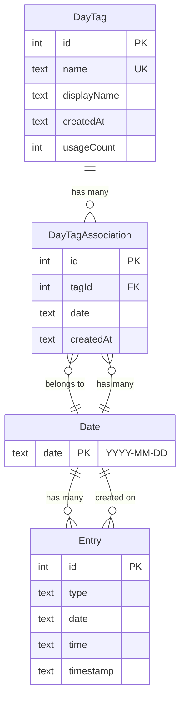

# Data Model: Day Tags

**Feature**: Day Tags
**Date**: 2025-10-25
**Status**: Final

## Overview

This document defines the data model for the Day Tags feature, including entity definitions, relationships, validation rules, and state transitions. The model extends the existing database schema while maintaining backward compatibility and following established patterns.

## Entity Definitions

### 1. DayTag Entity

**Purpose**: Represents a unique tag name that can be applied to calendar days.

**Attributes**:

| Field | Type | Constraints | Description |
|-------|------|-------------|-------------|
| `id` | integer | PRIMARY KEY, AUTO_INCREMENT | Unique identifier |
| `name` | text | NOT NULL, UNIQUE | Normalized lowercase tag name for matching |
| `displayName` | text | NOT NULL | Original capitalization for display |
| `createdAt` | text | DEFAULT CURRENT_TIMESTAMP | When tag was first created |
| `usageCount` | integer | DEFAULT 0 | Denormalized count of days using this tag |

**Validation Rules**:
```typescript
interface DayTagValidation {
  name: {
    minLength: 1,
    maxLength: 50,
    pattern: /^[a-z0-9\s\-_]+$/,  // Lowercase normalized
    unique: true,
  },
  displayName: {
    minLength: 1,
    maxLength: 50,
    pattern: /^[a-zA-Z0-9\s\-_]+$/,  // Preserves case
    required: true,
  }
}
```

**Indexes**:
- `PRIMARY KEY (id)`
- `UNIQUE INDEX idx_day_tags_name ON dayTags(name)`

**Business Rules**:
- Tag names are case-insensitive ("Vacation" == "vacation")
- Display name preserves user's original capitalization
- Usage count updated on association create/delete
- Soft delete not needed - hard delete when usageCount = 0

**Examples**:
```typescript
{
  id: 1,
  name: "vacation",
  displayName: "Vacation",
  createdAt: "2025-10-25T10:30:00.000Z",
  usageCount: 5
}

{
  id: 2,
  name: "new medicine - aspirin",
  displayName: "New Medicine - Aspirin",
  createdAt: "2025-10-25T11:15:00.000Z",
  usageCount: 14
}
```

---

### 2. DayTagAssociation Entity

**Purpose**: Links tags to specific calendar dates (many-to-many relationship).

**Attributes**:

| Field | Type | Constraints | Description |
|-------|------|-------------|-------------|
| `id` | integer | PRIMARY KEY, AUTO_INCREMENT | Unique identifier |
| `tagId` | integer | FOREIGN KEY → dayTags.id, NOT NULL, CASCADE DELETE | Reference to tag |
| `date` | text | NOT NULL, FORMAT: YYYY-MM-DD | Calendar date in ISO format |
| `createdAt` | text | DEFAULT CURRENT_TIMESTAMP | When association was created |

**Validation Rules**:
```typescript
interface DayTagAssociationValidation {
  tagId: {
    required: true,
    foreignKey: 'dayTags.id',
    onDelete: 'CASCADE',  // Delete associations when tag deleted
  },
  date: {
    required: true,
    format: 'YYYY-MM-DD',
    pattern: /^\d{4}-\d{2}-\d{2}$/,
    maxDate: 'today',  // No future dates
    minDate: '2020-01-01',  // Reasonable lower bound
  }
}
```

**Constraints**:
- `UNIQUE(tagId, date)` - Prevents duplicate tag-date pairs

**Indexes**:
- `PRIMARY KEY (id)`
- `INDEX idx_day_tag_assoc_date ON dayTagAssociations(date)` - Fast date lookups
- `INDEX idx_day_tag_assoc_tag ON dayTagAssociations(tagId)` - Fast tag-based filtering
- `UNIQUE INDEX idx_unique_tag_date ON dayTagAssociations(tagId, date)`

**Business Rules**:
- One tag can be associated with many dates
- One date can have many tags (max 10 per date)
- Deleting a tag cascades to delete all its associations
- Deleting an association decrements tag's usageCount
- No orphaned associations (enforced by foreign key)

**Examples**:
```typescript
// "Vacation" tag applied to Oct 25-27
[
  { id: 1, tagId: 1, date: "2025-10-25", createdAt: "2025-10-25T10:30:00Z" },
  { id: 2, tagId: 1, date: "2025-10-26", createdAt: "2025-10-25T10:30:00Z" },
  { id: 3, tagId: 1, date: "2025-10-27", createdAt: "2025-10-25T10:30:00Z" }
]

// Oct 25 has both "Vacation" and "New Medicine"
[
  { id: 1, tagId: 1, date: "2025-10-25", createdAt: "2025-10-25T10:30:00Z" },
  { id: 4, tagId: 2, date: "2025-10-25", createdAt: "2025-10-25T11:15:00Z" }
]
```

---

### 3. Extended Entry Entity (Read Model)

**Purpose**: Entries with inherited day tags (computed, not stored).

**Attributes** (extends existing Entry type):

| Field | Type | Description |
|-------|------|-------------|
| ...existing fields | | All current entry fields (id, type, date, time, etc.) |
| `dayTags` | DayTag[] | Array of day tags for entry's date (computed) |

**Computation Logic**:
```typescript
// Pseudo-SQL for fetching entries with day tags
SELECT
  entries.*,
  JSON_GROUP_ARRAY(
    JSON_OBJECT('id', dt.id, 'name', dt.name, 'displayName', dt.displayName)
  ) as dayTags
FROM entries
LEFT JOIN dayTagAssociations dta ON entries.date = dta.date
LEFT JOIN dayTags dt ON dta.tagId = dt.id
WHERE entries.date = ?
GROUP BY entries.id
```

**Business Rules**:
- Day tags are derived at query time, not stored on entries
- Retroactive: Adding a tag to a date immediately affects all entries on that date
- Deletion: Removing a tag from a date immediately removes it from all entries
- Display: Day tags visually distinct from entry-level tags (orange vs blue)

**Example**:
```typescript
// Entry on Oct 25 (which has "Vacation" and "New Medicine" tags)
{
  id: 42,
  type: 'bowel_movement',
  date: '2025-10-25',
  time: '08:30',
  timestamp: '2025-10-25T08:30:00.000Z',
  bowelMovement: { consistency: 4, urgency: 2, notes: 'Normal' },
  dayTags: [  // Inherited from date
    { id: 1, name: 'vacation', displayName: 'Vacation' },
    { id: 2, name: 'new medicine - aspirin', displayName: 'New Medicine - Aspirin' }
  ]
}
```

---

## Entity Relationships



**Relationship Details**:

1. **DayTag → DayTagAssociation** (1:N)
   - One tag can be applied to many dates
   - Cascade delete: removing tag removes all associations
   - Usage count tracks active associations

2. **Date → DayTagAssociation** (1:N)
   - One date can have many tags (max 10)
   - Date is stored as text, not a separate table
   - Index on date enables fast lookups

3. **Date → Entry** (1:N)
   - Existing relationship, unchanged
   - Entries reference date as text field
   - Join on date to compute day tags

4. **Entry → DayTag** (Indirect, computed)
   - Entries inherit day tags via date
   - No direct foreign key (computed at query time)
   - Read-only relationship from Entry perspective

---

## State Transitions

### Tag Lifecycle

```
[Non-existent]
    |
    | CREATE (user enters new tag)
    v
[Created] ← usageCount = 0
    |
    | ASSOCIATE (tag added to first date)
    v
[Active] ← usageCount > 0
    |
    | ASSOCIATE (tag added to more dates)
    | usageCount++
    |
    | DISASSOCIATE (tag removed from dates)
    | usageCount--
    |
    | DISASSOCIATE (last association removed)
    v
[Inactive] ← usageCount = 0
    |
    | DELETE (optional cleanup)
    v
[Deleted]
```

**State Rules**:
- Tags can be deleted at any time (cascade removes associations)
- Tags with usageCount = 0 can be auto-deleted or kept for history
- MVP: Keep all tags (no auto-deletion), user can delete manually

### Association Lifecycle

```
[Non-existent]
    |
    | CREATE (user adds tag to date)
    v
[Active]
    |
    | (Affects all entries on that date)
    |
    | DELETE (user removes tag from date)
    v
[Deleted]
```

**State Rules**:
- No soft delete - associations are hard deleted
- Deleting association updates tag's usageCount
- Cannot create duplicate associations (unique constraint)

### Entry Day Tag Inheritance (Computed State)

```
Entry Created
    |
    v
Query Entry → JOIN with dayTagAssociations by date
    |
    v
Compute dayTags array
    |
    v
Return Entry with dayTags
```

**State Rules**:
- Day tags are always fresh (computed on read)
- No synchronization needed when tags change
- Filtering happens at query level (WHERE tagId IN ...)

---

## Validation Rules Summary

### Tag Creation

```typescript
function validateTag(displayName: string): ValidationResult {
  const errors: ValidationError[] = [];

  // Length
  if (displayName.trim().length < 1) {
    errors.push({ field: 'tag', message: 'Tag cannot be empty' });
  }
  if (displayName.length > 50) {
    errors.push({ field: 'tag', message: 'Tag must be 50 characters or less' });
  }

  // Character set
  if (!/^[a-zA-Z0-9\s\-_]+$/.test(displayName)) {
    errors.push({
      field: 'tag',
      message: 'Tag can only contain letters, numbers, spaces, hyphens, and underscores'
    });
  }

  // Forbidden patterns
  if (/[<>{}[\]\\\/|"']/.test(displayName)) {
    errors.push({ field: 'tag', message: 'Tag contains invalid characters' });
  }

  return { isValid: errors.length === 0, errors };
}
```

### Association Creation

```typescript
function validateAssociation(tagId: number, date: string): ValidationResult {
  const errors: ValidationError[] = [];

  // Tag exists
  if (!tagExists(tagId)) {
    errors.push({ field: 'tagId', message: 'Tag does not exist' });
  }

  // Date format
  if (!/^\d{4}-\d{2}-\d{2}$/.test(date)) {
    errors.push({ field: 'date', message: 'Date must be in YYYY-MM-DD format' });
  }

  // No future dates
  if (isPastDate(date) === false && !isToday(date)) {
    errors.push({ field: 'date', message: 'Cannot tag future dates' });
  }

  // Date limit
  const associationsCount = await getAssociationsForDate(date);
  if (associationsCount.length >= 10) {
    errors.push({ field: 'date', message: 'Maximum 10 tags per day' });
  }

  // Duplicate check
  if (associationExists(tagId, date)) {
    errors.push({ field: 'association', message: 'Tag already applied to this date' });
  }

  return { isValid: errors.length === 0, errors };
}
```

---

## Query Patterns

### 1. Get all tags for a specific date

```typescript
// Returns: DayTag[]
async function getTagsForDate(date: string): Promise<DayTag[]> {
  return db
    .select({
      id: dayTags.id,
      name: dayTags.name,
      displayName: dayTags.displayName
    })
    .from(dayTags)
    .innerJoin(dayTagAssociations, eq(dayTagAssociations.tagId, dayTags.id))
    .where(eq(dayTagAssociations.date, date))
    .orderBy(dayTags.displayName);
}
```

### 2. Get all entries with day tags for a date

```typescript
// Returns: Entry[] with dayTags property
async function getEntriesWithDayTags(date: string): Promise<EntriesWithDayTags[]> {
  // First get entries
  const entries = await db
    .select()
    .from(entries)
    .where(eq(entries.date, date));

  // Then get tags for that date
  const tags = await getTagsForDate(date);

  // Attach tags to all entries
  return entries.map(entry => ({
    ...entry,
    dayTags: tags
  }));
}
```

### 3. Filter entries by tag (single tag)

```typescript
// Returns: Entry[] with dayTags property
async function getEntriesByTag(
  tagName: string,
  startDate: string,
  endDate: string
): Promise<EntriesWithDayTags[]> {

  // Find tag
  const tag = await db
    .select()
    .from(dayTags)
    .where(eq(dayTags.name, normalizeTag(tagName)))
    .get();

  if (!tag) return [];

  // Get all dates with this tag in range
  const dates = await db
    .select({ date: dayTagAssociations.date })
    .from(dayTagAssociations)
    .where(
      and(
        eq(dayTagAssociations.tagId, tag.id),
        gte(dayTagAssociations.date, startDate),
        lte(dayTagAssociations.date, endDate)
      )
    );

  // Get entries for those dates
  const entries = await db
    .select()
    .from(entries)
    .where(
      and(
        inArray(entries.date, dates.map(d => d.date)),
        gte(entries.date, startDate),
        lte(entries.date, endDate)
      )
    )
    .orderBy(desc(entries.timestamp));

  // Attach day tags to each entry
  return attachDayTagsToEntries(entries);
}
```

### 4. Filter entries by multiple tags (AND logic)

```typescript
// Returns: Entry[] where date has ALL specified tags
async function getEntriesByAllTags(
  tagNames: string[],
  startDate: string,
  endDate: string
): Promise<EntriesWithDayTags[]> {

  // Get tag IDs
  const tags = await db
    .select({ id: dayTags.id })
    .from(dayTags)
    .where(inArray(dayTags.name, tagNames.map(normalizeTag)));

  if (tags.length !== tagNames.length) {
    throw new Error('One or more tags not found');
  }

  const tagIds = tags.map(t => t.id);

  // Find dates that have ALL tags (using HAVING COUNT)
  const dates = await db
    .select({ date: dayTagAssociations.date })
    .from(dayTagAssociations)
    .where(
      and(
        inArray(dayTagAssociations.tagId, tagIds),
        gte(dayTagAssociations.date, startDate),
        lte(dayTagAssociations.date, endDate)
      )
    )
    .groupBy(dayTagAssociations.date)
    .having(sql`COUNT(DISTINCT ${dayTagAssociations.tagId}) = ${tagIds.length}`);

  // Get entries for those dates
  return getEntriesForDates(dates.map(d => d.date));
}
```

### 5. Get all unique tags (for autocomplete)

```typescript
// Returns: DayTag[] ordered by usage
async function getAllTags(): Promise<DayTag[]> {
  return db
    .select()
    .from(dayTags)
    .orderBy(desc(dayTags.usageCount), asc(dayTags.displayName));
}
```

### 6. Get dates with tags for calendar month

```typescript
// Returns: Record<date, tagNames[]> for marking calendar
async function getTaggedDatesInMonth(
  year: number,
  month: number
): Promise<Record<string, string[]>> {

  const startDate = `${year}-${month.toString().padStart(2, '0')}-01`;
  const endDate = `${year}-${month.toString().padStart(2, '0')}-31`;

  const results = await db
    .select({
      date: dayTagAssociations.date,
      tagName: dayTags.displayName
    })
    .from(dayTagAssociations)
    .innerJoin(dayTags, eq(dayTagAssociations.tagId, dayTags.id))
    .where(
      and(
        gte(dayTagAssociations.date, startDate),
        lte(dayTagAssociations.date, endDate)
      )
    );

  // Group by date
  return results.reduce((acc, row) => {
    if (!acc[row.date]) acc[row.date] = [];
    acc[row.date].push(row.tagName);
    return acc;
  }, {} as Record<string, string[]>);
}
```

---

## Migration Scripts

### Initial Migration (Drizzle)

```sql
-- Create dayTags table
CREATE TABLE IF NOT EXISTS dayTags (
  id INTEGER PRIMARY KEY AUTOINCREMENT,
  name TEXT NOT NULL UNIQUE,
  displayName TEXT NOT NULL,
  createdAt TEXT DEFAULT CURRENT_TIMESTAMP,
  usageCount INTEGER DEFAULT 0
);

CREATE UNIQUE INDEX idx_day_tags_name ON dayTags(name);

-- Create dayTagAssociations table
CREATE TABLE IF NOT EXISTS dayTagAssociations (
  id INTEGER PRIMARY KEY AUTOINCREMENT,
  tagId INTEGER NOT NULL,
  date TEXT NOT NULL,
  createdAt TEXT DEFAULT CURRENT_TIMESTAMP,
  FOREIGN KEY (tagId) REFERENCES dayTags(id) ON DELETE CASCADE
);

CREATE INDEX idx_day_tag_assoc_date ON dayTagAssociations(date);
CREATE INDEX idx_day_tag_assoc_tag ON dayTagAssociations(tagId);
CREATE UNIQUE INDEX idx_unique_tag_date ON dayTagAssociations(tagId, date);
```

### Rollback Strategy

```sql
-- Drop tables in reverse order (associations first due to FK)
DROP TABLE IF EXISTS dayTagAssociations;
DROP TABLE IF EXISTS dayTags;
```

**Note**: No data loss on rollback since this is a new feature. Existing entries table unaffected.

---

## Performance Considerations

### Indexes Rationale

1. **dayTags.name (UNIQUE)**: Fast tag lookup by normalized name, prevents duplicates
2. **dayTagAssociations.date**: Fast "get tags for date" queries (calendar, entry views)
3. **dayTagAssociations.tagId**: Fast "get dates with tag" queries (filtering)
4. **dayTagAssociations(tagId, date) UNIQUE**: Prevents duplicate associations, composite index

### Query Optimization

- **Prepared statements**: Reuse compiled queries for repeated operations
- **Batch operations**: Group multiple associations in single transaction
- **Denormalization**: usageCount on dayTags avoids COUNT queries
- **Left joins**: Use LEFT JOIN for optional day tags, INNER JOIN for filtering

### Caching Strategy

- **Store-level cache**: Current month's tagged dates in memory
- **Invalidation**: Clear cache on tag create/delete for current month
- **Autocomplete cache**: All tags cached in store, refreshed on create/delete

### Scalability

**Current Load (from spec assumptions)**:
- ~20 active tags
- ~1000 entries
- ~0-3 tags per day

**Projected Load (10x growth)**:
- 200 tags: Still fits in memory, indexes handle efficiently
- 10,000 entries: Filtered queries return <1000 results, <3s target met
- 30 tags per day: UI becomes cluttered before DB performance issue

**Bottlenecks**:
- None expected at projected scale
- SQLite handles 100k+ rows efficiently with indexes
- Mobile memory limit (200MB) not approached

---

## Testing Data Model

### Test Database Seeding

```typescript
// Seed data for tests
const testTags = [
  { name: 'vacation', displayName: 'Vacation' },
  { name: 'new medicine', displayName: 'New Medicine' },
  { name: 'high stress', displayName: 'High Stress' },
];

const testAssociations = [
  { tagId: 1, date: '2025-10-25' },  // Vacation on Oct 25
  { tagId: 2, date: '2025-10-25' },  // New Medicine on Oct 25
  { tagId: 1, date: '2025-10-26' },  // Vacation on Oct 26
];

const testEntries = [
  { type: 'bowel_movement', date: '2025-10-25', time: '08:30' },
  { type: 'note', date: '2025-10-25', time: '12:00' },
  { type: 'bowel_movement', date: '2025-10-26', time: '09:00' },
];
```

### Test Scenarios

1. **Create tag with duplicate normalized name**: Should return existing tag
2. **Delete tag**: Should cascade delete associations, decrement usageCount
3. **Add 11th tag to day**: Should fail validation (max 10)
4. **Filter by non-existent tag**: Should return empty array
5. **Filter by multiple tags (AND)**: Should return only entries on dates with ALL tags
6. **Compute day tags for entry**: Should reflect current tag state (retroactive)

---

## Approval

**Data Model Status**: ✅ Final - Ready for implementation
**Reviewed**: 2025-10-25
**Next Step**: Generate API contracts (service methods)
